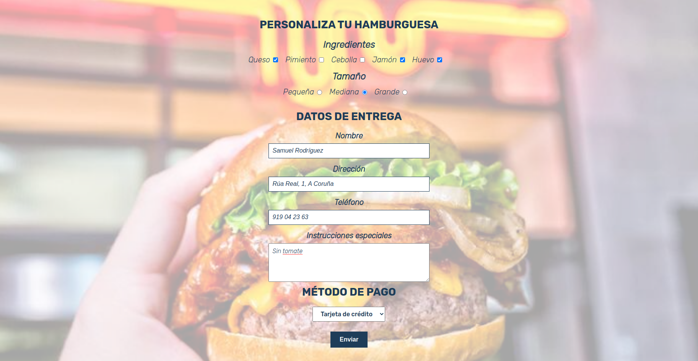

Edita el fichero `index.html` para que muestre un formulario con las siguientes características:

- Debe estar organizado en tres fieldsets (personalizar hamburguesa, datos de entrega y método de pago)

- En el primer fieldset debe haber un apartado para escoger los ingredientes deseados y otro para escoger el tamaño (se pueden seleccionar varios ingredientes, pero sólo un tamaño)

- El segundo fielset debe tener estos campos:

  - Nombre, control tipo text, obligatorio.
  - Dirección, control tipo text, obligatorio.
  - Teléfono, control tipo tel, obligatorio.
  - Instrucciones especiales, textarea.

- El tercer fieldet debe tener un desplegable donde seleccionas el método de pago deseado, obligatorio.

- Al final del formulario, debe haber un botón de enviar.

- Todos los campos deben tener su label asociado mediante la propiedad for.

-Recuerda que puedes meter un fieldset dentro de otro si lo consideras conveniente.

El HTML resultante debe ser validado por el [validador de HTML de la W3](https://validator.w3.org/#validate_by_input) y no dar ningún error.

A continuación maqueta el formulario para que tenga un aspecto como el de esta imagen.

Para practicar selectores, intenta no seleccionar elementos por clase o id en tu fichero css.

El HTML resultante debe ser validado por el [validador de HTML de la W3](https://validator.w3.org/#validate_by_input) y no dar ningún error.
