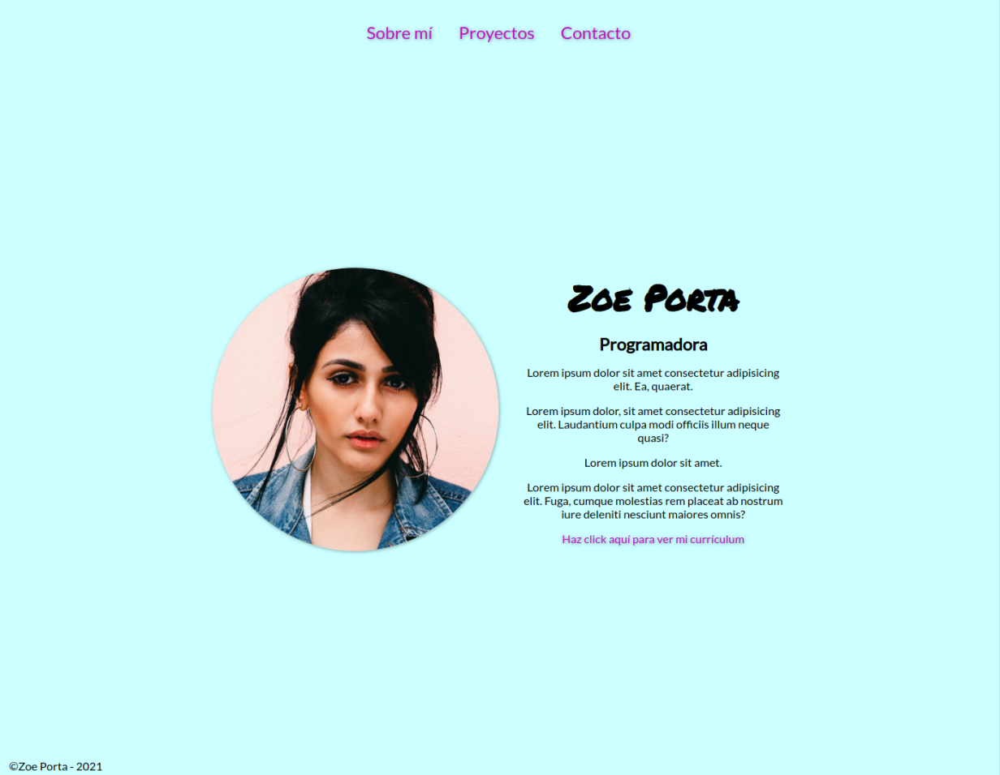
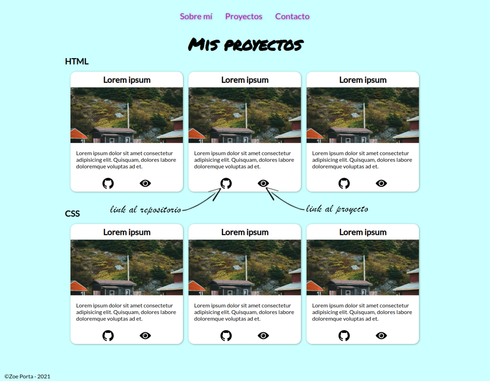
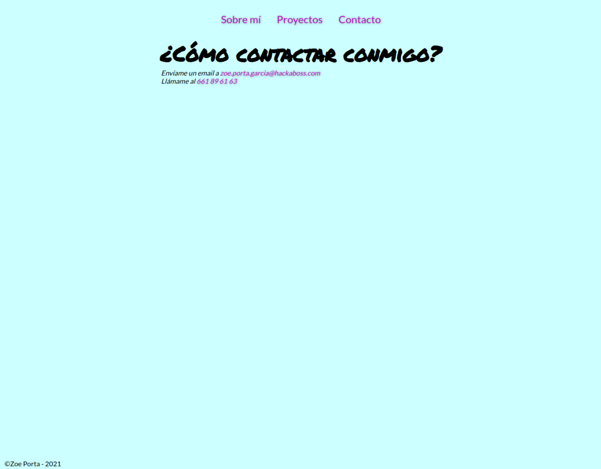

# Sitio web

Dale estilos a tu porfolio (ejercicio 2-SitioWeb de S1-LayoutI) siguiendo este ejemplo:

**Puedes darle tu estilo cambiando los colores y tipografías, pero intenta ceñirte al layout**

El CSS resultante debe ser validado por el [validador de CSS de la W3](https://jigsaw.w3.org/css-validator/#validate_by_input) y no dar ningún error.
